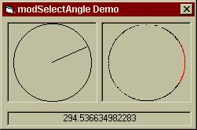



## Angle Selector \- Advanced Trig

### Description

Ever wonder how image editors create their angle selectors? Ever needed a dialog to select an angle? This code is for you. Using advanced math functions NOT built into VB, this code creates a selector in a picture box. It has functions to return the ArcSine of a number and to convert degrees into radians and back.
 
### More Info
 
X, Y

A picture box, with square sides.

theAngle

             |
---                |---
**Submitted On**   |2001-05-22 17:55:16
**By**             |[Jeffrey Katz](https://github.com/Planet-Source-Code/PSCIndex/blob/master/ByAuthor/jeffrey-katz.md)
**Level**          |Advanced
**User Rating**    |4.5 (18 globes from 4 users)
**Compatibility**  |VB 6\.0
**Category**       |[Math/ Dates](https://github.com/Planet-Source-Code/PSCIndex/blob/master/ByCategory/math-dates__1-37.md)
**World**          |[Visual Basic](https://github.com/Planet-Source-Code/PSCIndex/blob/master/ByWorld/visual-basic.md)
**Archive File**   |[Angle Sele199525232001\.zip](https://github.com/Planet-Source-Code/jeffrey-katz-angle-selector-advanced-trig__1-23374/archive/master.zip)

